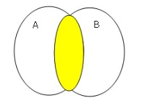
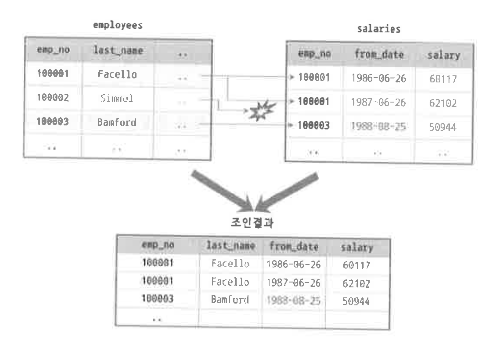
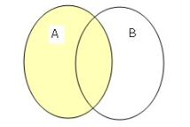
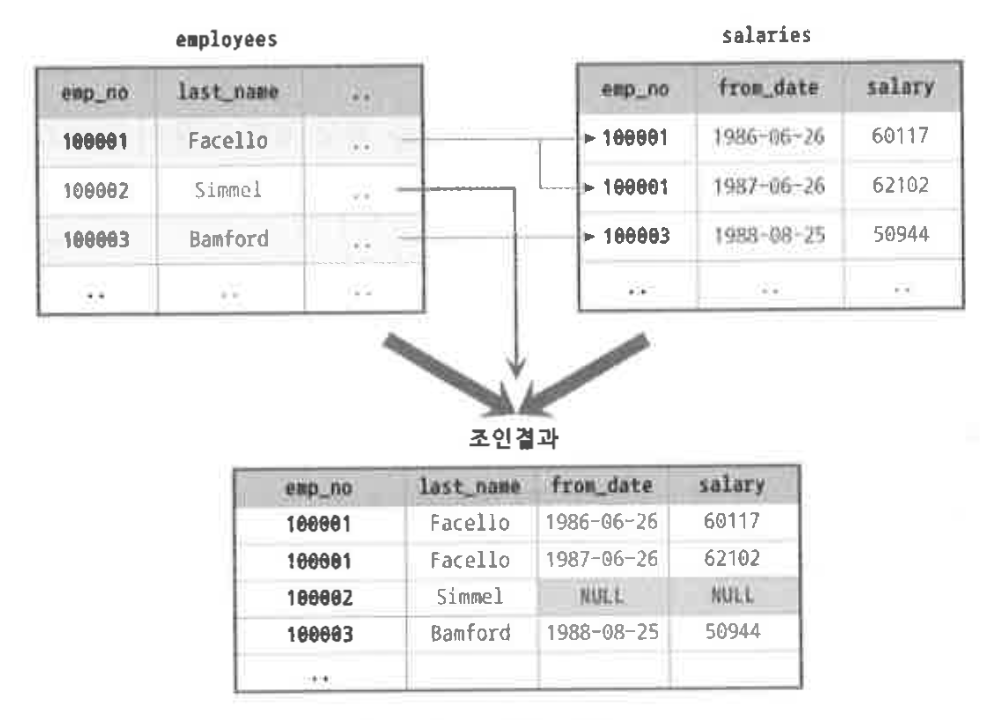

# 💬 목차

[Transaction이란?](#transaction이란)  
[SQL Injection이란?](#sql-injection이란)  
[이너조인과 아우터조인을 비교해서 설명해주세요](#이너조인과 아우터조인을 비교해서 설명해주세요)  

# Transaction이란?

트랜잭션은 은행 업무나 데이터베이스에서 더 이상 쪼개질 수 없는 최소의 작업단위를 뜻하며,
더 자세하게 데이터베이스의 트렌젝션은 데이터베이스의 상태를 변화시키기 위해서 수행하는 작업의 단위를 의미합니다.  
트랜잭션은 원자성, 일관성, 독립성, 지속성 4가지의 특징을 가지고 있습니다.(ACID)

### 원자성, Atomicity
한 트랜잭션의 연산들이 모두 성공하거나, 모두 실패하는 것을 보장하는 것을 의미합니다.  
(부분적인 성공, 실패가 없다라는 의미)
### 일관성, Consistency
데이터는 미리 정의된 규칙에서만 조작이 가능하도록 보장하는 것을 의미합니다.
### 독립성, Isolation
트랜잭션을 수행 시 다른 트랜잭션의 연산 작업이 끼어들지 못하도록 보장하는 것을 의미합니다.
### 지속성, Durability
성공적으로 수행된 트랜잭션은 영원히 반영되어야 함을 의미합니다.

### 트랜잭션의 격리 수준(Isolation Level)이란?
트랜잭션의 격리 수준이란 동시에 여러 트랜잭션이 수행될 때,
특정 트랜잭션이 다른 트랜잭션에서 변경하거나 조회하는 데이터를 볼 수 있도록 허용할지 말자를 결정하는 것입니다.  
격리 수준은 다음과 같이 4가지로 정의 할 수 있습니다.
- READ UNCOMMITTED(커밋되지 않은 읽기)
- READ COMMITTED(커밋된 읽기)
- REPEATABLE READ(반복 가능한 읽기)
- SERIALIZABLE(직렬화 가능)

순서대로 READ UNCOMMITTED의 격리 수준이 가장 낮고 SERIALIZABLE의 격리 수준이 가장 높습니다.
트랜잭션의 격리 수준이 낮을수록 더 많은 문제가 발생합니다.

[[데이터베이스] 트랜잭션의 ACID 성질](https://hanamon.kr/%EB%8D%B0%EC%9D%B4%ED%84%B0%EB%B2%A0%EC%9D%B4%EC%8A%A4-%ED%8A%B8%EB%9E%9C%EC%9E%AD%EC%85%98%EC%9D%98-acid-%EC%84%B1%EC%A7%88/)  
[트랜잭션의 격리 수준(isolation Level)이란?](https://nesoy.github.io/articles/2019-05/Database-Transaction-isolation)  
[[MySQL] - 트랜잭션의 격리 수준(Isolation level)](https://zzang9ha.tistory.com/381)

# SQL Injection이란?

SQL 인젝션(또는 SQL 삽입, SQL 주입)은 코드 인젝션의 한 기법으로 클라이언트의 입력값을 조작하여
서버의 데이터베이스를 공격할 수 있는 공격방식을 말합니다. 주로 사용자가 입력한 데이터를 제대로 필터링,
이스케이핑하지 못했을 경우에 발생합니다.  
쉬운 공격 난이도에 비해 발생하는 피해는 어머어마하기 때문에
시큐어 코딩을 하는 개발자라면 가장 먼저 배우게 되는 내용입니다.  
이러한 인젝션 계열의 취약점들은 테스트를 통한 발견은 어렵지만 스캐닝툴이나 코드 검증절차를 거치면 보통 쉽게 발견되기 때문에 탐지하기는 쉬운 편이라고 합니다.

### 공격 목적
SQL 인젝션의 대표적인 목적으로는 다음과 같은 것들이 있습니다.
1. 정보 유출
2. 저장된 데이터 유출 및 조작
3. 원격 코드 실행
4. 인증 우회

### 공격 방법
SQL 인젝션 공격의 대표적인 방법으로는 로그인 폼을 대상으로 하는 공격이 있습니다.
이를 통해 정상적인 계정 정보 없이도 로그인을 우회하여 인증을 획득할 수 있습니다.  

또한 시스템에서 발생하는 에러 메세지를 이용해 공격하는 방법도 존재합니다. 이외에도 다양한 SQL 인젝션 공격 방법이 존재합니다.

### 대응 방안
SQL 인젝션 공격에 대한 대응 방안으로는 대표적으로 3가지를 꼽을 수 있습니다.
1. 입력 값에 대한 검증
2. Error Message 노출 금지
3. Prepared Statement 구문사용
위와 같은 방법을 통해 어느정도 SQL 인젝션 공격에 대한 공격이 가능합니다.

[SQL injection](https://namu.wiki/w/SQL%20injection)  
[[Database] SQL Injection - 개념, 공격 방법, 방어 방법](https://velog.io/@yanghl98/Database-SQL-Injection)

# 이너조인과 아우터조인을 비교해서 설명해주세요

### JOIN의 종류

JOIN의 종류는 크게 INNER JOIN과 OUTER JOIN으로 구분할 수 있고, OUTER JOIN은 다시 LEFT OUTER JOIN, RIGHT OUTER JOIN, FULL OUTER JOIN으로 구분할 수 있습니다.
조인의 처리에서 어느 테이블을 먼저 읽을지를 결정하는 것은 상당히 중요하며, 그에 따라 처리할 작업량이 상당히 달라집니다.

INNER JOIN은 어느 테이블을 먼저 읽어도 결과가 달라지지 않으므로 MySQL 옵티마이저가 JOIN의 순서를 조절해서 다양한 방법으로 최적화를 수행할 수 있습니다. 하지만 OUTER JOIN은 반드시 OUTER가 되는 테이블을 먼저 읽어야 하기 때문에 조인 순서를 옵티마이저가 선택할 수 없습니다.

1. INNER JOIN  
조인이 되는 키값을 기준으로 교집합 (NULL값을 포함하지 않는다)

2. OUTER JOIN  
조인이 되는 키값을 기준으로 기준테이블 Key 집합 (기준테이블은 NULL값을 포함한다)

[Inner Join과 Outer Join 차이점](https://server-engineer.tistory.com/306)  
[[MySQL] Inner JOIN과 Outer JOIN의 차이가 무엇일까?](https://devlog-wjdrbs96.tistory.com/347) 

