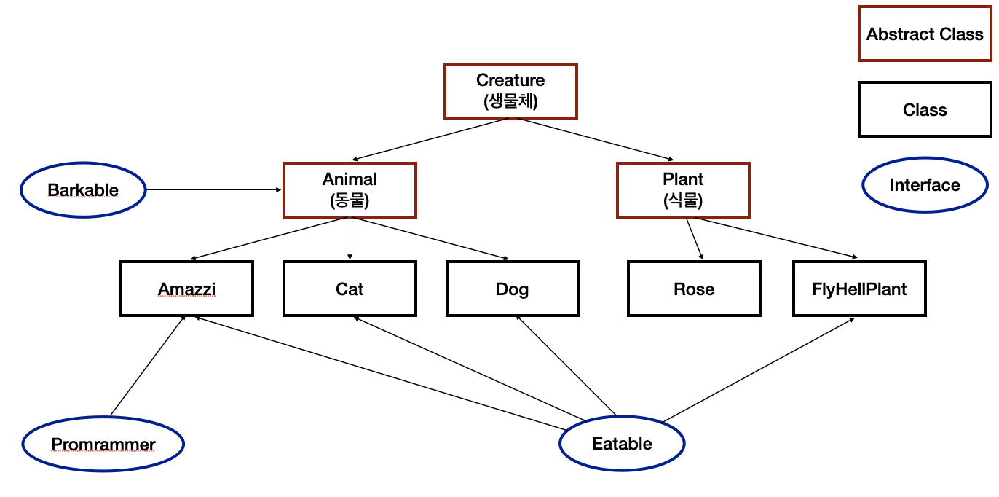
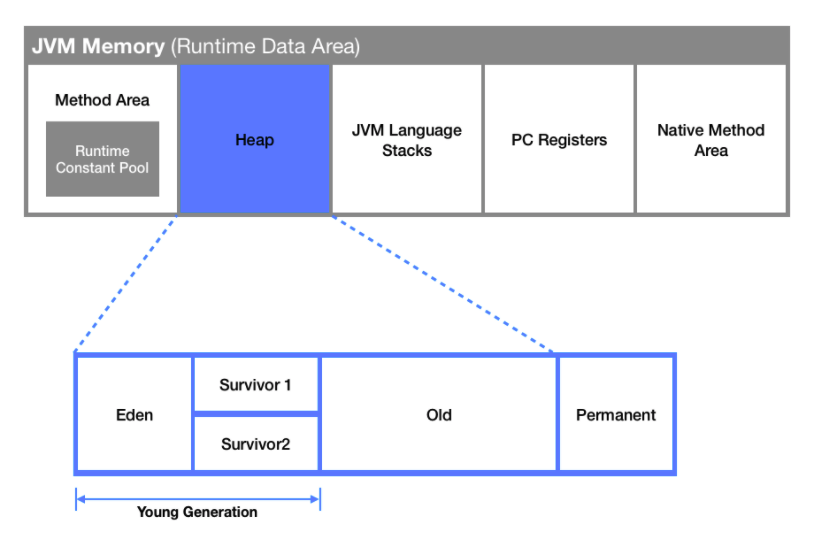
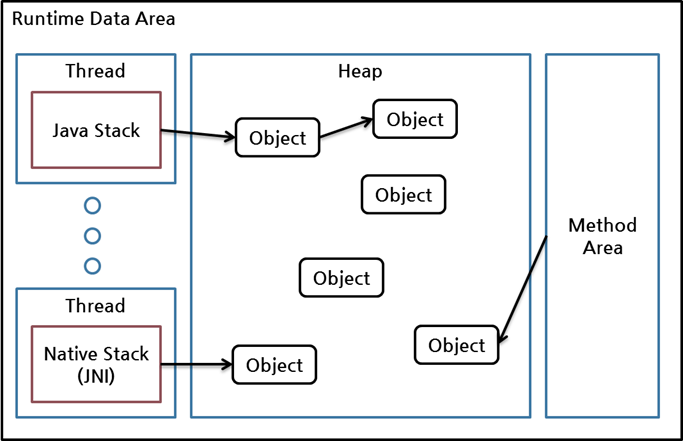
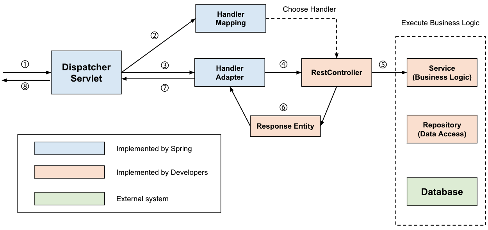

# 💬 목차

[추상클래스와 인터페이스의 차이점에 대해 설명해주세요](#추상클래스와-인터페이스의-차이점에-대해-설명해주세요)  
[Garbage Collector란 무엇인가요?](#garbage-collector란-무엇인가요)  
[디스페처 서블릿은 어떤 역할을 하는지 설명해주세요](#디스페처-서블릿은-어떤-역할을-하는지-설명해주세요)  
[POJO란 무엇인가?](#pojo란-무엇인가)<br/>
[영속성 컨텍스트란 무엇인가?](#영속성-컨텍스트란-무엇인가)<br/>
[제네릭이란 무엇이고 사용하는 이유를 설명해주세요](#제네릭이란-무엇이고-사용하는-이유를-설명해주세요)<br/>
[접근제어자란?](#접근제어자란)


# 추상클래스와 인터페이스의 차이점에 대해 설명해주세요.

## 추상 클래스 VS 인터페이스

### 공통점 ?

먼저 추상 클래스와 인터페이스의 공통점을 찾아보자.추상 클래스와 인터페이스 둘 다 **가지고 있는 추상 메서드를 구현하도록 강제한다.**또 **인스턴스화가 불가능**하다.

그렇다면 추상 클래스 안에 원하는 것만 추상 메서드를 여러개 두거나,전부 추상 메서드로 만들면 되어 추상 클래스가 인터페이스 역할을 할 수 있다.만약 모든 클래스가 인터페이스만 사용해서 구현한다면,모든 클래스에서 공통으로 필요한 기능들은 각각 오버라이딩 하게 되니 코드의 중복이 발생한다.때문에 이 공통으로 필요한 기능들을 부모 클래스에서 일반 메서드로 구현한추상클래스를 상속 받아 자식 클래스에서 사용할 수 있도록 하면 될거같은데...**왜 인터페이스는 왜 필요한걸까? 🤔**

### 접근자

**인터페이스**에서 모든 변수는 `public static final`,모든 메소드는 `public abstract`이다.하지만 **추상 클래스**에서는 `static`이나 `final`이 아닌 필드를 가질 수 있고,`public, protected, private` 모두 가질 수 있다.

개인적인 생각으로는 인터페이스만을 구현하면 `public static final`만을 사용해구현 객체의 같은 상태를 공유할수 밖에 없는데,추상 클래스는 `static`이나 `final`이 아닌 필드또한 가질 수 있기 때문에추상 클래스를 상속 받은 객체들이 같은 상태를 가지고 있을 수 있다.

### 다중 상속 여부

**인터페이스**를 구현하는 클래스는 다른 여러개 인터페이스를 함께 구현할 수 있다.하지만 자바에서는 다중 상속을 지원하지 않기 때문에 여러 추상 클래스를 상속할 수 없다.

### 사용 의도

물론 다중 상속 여부의 차이는 있지만 이것이 포인트가 아니라,이에 따른 사용 목적이 다르다는 것에 포인트를 맞춰보자.위에서 말한 다중 상속 여부에 따라 추상 클래스와 인터페이스의 사용 의도 또한 다르다.

**추상 클래스**는 이를 상속할 각 객체들의 공통점을 찾아 추상화시켜 놓은 것으로,상속 관계를 타고 올라갔을 때 같은 부모 클래스를 상속하며부모 클래스가 가진 기능들을 구현해야할 경우 사용한다.

**인터페이스**는 상속 관계를 타고 올라갔을 때다른 조상 클래스를 상속하더라도, 같은 기능이 필요할 경우 사용한다.클래스와 별도로 구현 객체가 같은 동작을 한다는 것을 보장하기 위해 사용한다.

### Exmaple

아래와 같은 관계를 갖는 예제를 살펴본다.



### 각각의 적절한 사용 케이스 정리

### 추상 클래스

- 관련성이 높은 클래스 간에 코드를 공유하고 싶은 경우
- 추상 클래스를 상속 받을 클래스들이 공통으로 가지는 메소드와 필드가 많거나,public이외의 접근자(protected, private) 선언이 필요한 경우
- non-static, non-final 필드 선언이 필요한 경우 (각 인스턴스에서 상태 변경을 위한 메소드가 필요한 경우)

### 인터페이스

- 서로 관련성이 없는 클래스들이 인터페이스를 구현하게 되는 경우.ex) Comparable, Cloneable 인터페이스는 여러 클래스들에서 구현되는데, 구현클래스들 간에 관련성이 없다.
- 특정 데이터 타입의 행동을 명시하고 싶은데, 어디서 그 행동이 구현되는지는 신경쓰지 않는 경우.
- 다중상속을 허용하고 싶은 경우


[추상클래스와 인터페이스](https://tranquil-queen-c5a.notion.site/73ecd4919d4f4a5ebf3a1a9a8dbcd217)

# Garbage Collector란 무엇인가요?

Java 이전의 C나 C++ 같은 언어에서는 개발자가 직접 메모리 할당과 해제를 컨트롤 해야했습니다.
때문에 개발자는 잦은 메모리 이슈로부터 자유로울수 없었는데, 이를 어느정도 해소하기 위해 가비지 컬렉터가 등장하였습니다.

### Garbage Collection(GC)
가비지 컬렉션이란, 메모리 관리 방법 중 하나로, 시스템에서 더이상 사용하지 않는
동적 할당된 메모리 블럭을 찾아 자동으로 다시 사용 가능한 자원으로 회수하는 것입니다.  
시스템에서 가비지 컬렉션을 수행하는 부분을 **가비지 컬렉터**라고 부릅니다.

### Garbage Collector의 원리
GC 작업을 하는 가비지 컬렉터는 다음과 같은 일을 합니다.
- 메모리 할당
- 사용중인 메모리 인식
- 사용하지 않는 메모리 인식



JVM에는 Heap 메모리 영역이 존재합니다.

Heap 메모리의 각 영역을 간략히 설명하자면,
- Young : 비교적 젊은 Reference가 살아있는 곳
  - Eden : Young 영역 중에서도 특히 갓 생성된 Reference가 살아있는 곳
- Old : 특정 횟수 이상 살아남은 Reference가 살아있는 곳
- Permanent : Method Area의 메타정보가 기록된 곳

으로 정리할 수 있습니다.

### Minor GC와 Major GC
Young 영역에서 발생한 GC를 Minor GC라고 하며, 여기서 실행되는 알고리즘을 **Stop and Copy 알고리즘**이라고 부릅니다.
Stop and Copy 알고리즘은 CG의 빈도를 높여 자잘한 청소작업을 여러번하여
사용자로 하여금 프로그램이 정지되는 경험을 주지 않게하고, 단편화 역시 처리하는 알고리즘입니다. 
> 대부분의 객체는 생성되고 얼마안돼 Unreachable하게 되는데, 대부분의 오래된 객체는 젊은 객체를 적게 참조하기 때문입니다.

나머지 두 영역에서 발생한 GC를 Major GC라고 하며, 메모리가 커서 성능이슈가 발생할 수 있습니다.

### 누가 쓰레기(Garbage)인가?
가비지 컬렉터는 그럼 정리할 쓰레기를 어떻게 판단 할까요?

바로 Reachable과 Unreachable, 즉 치우면 안되는 것과 치워야 하는 것으로 구분하여 판단합니다.

그림에 화살표로 이어진 Object들은 참조가 이루어진 것으로 Reachable 상태이고, 반대로 화살표로 이어지지 않은 Object들은 참조가 없는 것으로 Unreachable 상태입니다.
> 가비지 컬렉션은 특정 객체가 쓰레기인지 아닌지 판단하기 위해서 도달성, 도달능력이라는 개념을 적용합니다.
> 객체에 유효한 레퍼런스가 없다면 Unreachable 상태로 구분하고 수거의 대상이 되는 것입니다.

이렇게 상태로 구분이된 Object들은 GC의 알고리즘과 구현방식에 의해 이동, 압축 및 삭제를 거치게 됩니다.

[Garbage Collector 제대로 알기](https://velog.io/@recordsbeat/Garbage-Collector-%EC%A0%9C%EB%8C%80%EB%A1%9C-%EC%95%8C%EA%B8%B0)
[가비지 컬렉션, 컬렉터(Garbage Collection)란?](https://blog.metafor.kr/163)

# 디스페처 서블릿은 어떤 역할을 하는지 설명해주세요

### 먼저 서블릿이란 무엇인가?
클라이언트의 요청에 그 결과를 다시 전송해주는데 이러한 역할을 하는 자바 프로그램

### 디스패처 서블릿의 정의
디스패처 서블릿은 HTTP 프로토콜로 들어오는 모든 요청을 가장 먼저 받아 적합한 컨트롤러에 위임해주는 프론트 컨트롤러

### 디스패처 서블릿의 장점 
과거에는 모든 서블릿을 URL 매핑을 위해 web.xml에 등록해주어야 했지만,
디스패처 서블릿이 해당 어플리케이션으로 들어오는 모든 요청을 핸들링해주고 공통 작업을 처리함

### 디스패처 서블릿의 동작 방식

디스패처 서블릿을 통해 요청을 처리할 컨트롤러를 찾아서 위임하고 그 결과를 받아옴
<br>
<br>  
  
# POJO란 무엇인가?  
  
POJO(Plain-Old-Java-Object)는 말 그대로 순수한 자바 오브젝트를 뜻한다.  
POJO라는 개념은 예전에 JavaEE등의 중량 프레임워크(특히 EJB) 을 사용하면서 단순한 자바 오브젝트를 사용해서 개발하는 것이 아닌 프레임워크에 종속적인 부분으로 개발을 진행했다.  
그로 인하여 모듈의 교체, 시스템 업그레이드 시 종속성으로 인한 불편함이 발생을 했고, 해당 프레임워크에 종속된 무거운 객체를 만들게 되는 것에 반발하여 2000년 9월 마틴 파울러, 레베카 파슨, 조쉬 맥킨지 등이 사용하기 시작한 용어이다.<br>  

### POJO를 지킨 예제  
```java
public class Member {
    private String id;
    private String password;
  
    public String getId() {
        return id;
    }

    public void setId(String id) {
        this.id = id;
    }

    public String getPassword() {
        return password;
    }

    public void setPassword(String password) {
        this.password = password;
    }
}
```

# 자바 애플리케이션이 실행되는 과정에 대해서 설명해주세요?

**.java - compiler - .class - JVM( 로딩, 배치 ) →실행**

java 파일을 java 컴파일러가 가상 기계어 파일인 java 클래스 파일 즉, java 바이트 코드로 번역한다.

**java 바이트 코드**

JVM이 이해할 수 있는 언어로 변환된 자바 소스 코드 / 확장자 : .class

**JVM**

javaVirtual Machine의 줄임말로 OS 마다 따로 코드를 작성해야하는 번거로움 없이 java가 플랫폼에서 독립적으로 사용가능하게 번역해준다.

**동작 과정**

**Java Compiler** → java Source file을 Java Byte Code(.class)로 변경

**Class Loader** → JVM내로 .class 파일 Load / Loading 된 클래스들은 Runtime Data Area에 배치

**Execution Engine** → Loading 된 클래스의 Bytecode 해석

**Runtime Data Area** → JVM이 프로세스로써 수행되기 위해 OS로부터 할당받는 메모리 영역

- Method Area → 모든 Thread에게 공유되며, 클래스 정보, 변수 정보, Method정보, static변수 정보, 상수 정보 등이 저장되는 영역
- Heap Area → 모든 Thread에게 공유되며, new 명령어로 생성된 인스턴스와 객체가 저장되는 구역, 공간이 부족해지면 Garbage Collection이 실행
- Stack Area → 각 스레드마다 하나씩 생성된다. Method안에서 사용되는 값들(매개변수, 지역변수, 리턴 값 등)이 저장되는 구역
- PC Register → 각 스레드마다 하나씩 생성되고, CPU의 Register와 역할이 비슷함. 현재 수행 중인 JVM명령의 주소 값이 저장
- Native Method Stack → 각 스레드마다 하나씩 생성되고, 다른 언어(C/C++ 등)의 메서드 호출을 위해 할당되는 구역 언어에 맞게 Stack이 형성되는 구역 JNI(Java Native Interface)라는 표준 규약을 제공

# 영속성 컨텍스트란 무엇인가
- JPA에서 엔티티를 관리하는 환경, 영역
- Entity Manager가 엔티티를 저장하거나 조회할때 사용됨

## 역할

엔티티 매니저는 엔티티를 영속성 컨텍스트에 보관하고 이후 엔티티를 사용하 때 영속성 컨텍스트에서 엔티티를 가져옴

## 기능

**1차 캐시**를 제공하여 같은 엔티티를 조회할 때 DB에 접근하지 않고 캐시에서 가져오게 되어 
반복 조회 작업시 성능향상을 기대할 수 있음
<details>
<summary>1차캐시</summary>
<div markdown="1">
  
- 1차 캐시는 Entity Manager(EM)가 관리하는 Entity 객체들이 저장되는 영역

- EM이 `find()` `persist()` `merge()` 등의 메소드를 호출하면 Entity 객체가 생성되고, 이 객체는 1차 캐시에 저장됨

- 이후 같은 Entity를 조회하면 DB이전에 먼저 1차 캐시에서 조회됨

- 1차 캐시는 트랜잭션 범위 내에서만 유효함, 즉 EM이 시작한 트랜잭션이 종료되기 전까지만 1차 캐시가 유지되며 해당 트랜잭션이 종료되면 영속성 컨텍스트와 1차 캐시도 함께 종료된다 

</div>
</details>

## 한계점

### 메모리 누수

영속성 컨텍스트는 엔티티를 메모리에 보관하기 때문에 메모리 누수가 발생할 수 있음

대용량 트랜잭션 처리나 긴 생명주기를 가진 애플리케이션에서는 주의해야함

### 동시성 문제

여러 스레드에서 동시에 같은 엔티티를 수정하면 영속성 컨텍스트는 DB에 업데이트를 시도할 때 버전체크 등의 동시성을 제어할 수 없어 데이터무결성 문제가 발생할 수 있음

### N+1문제

연관된 엔티티를 조회할 대 엔티티의 개수만큼 쿼리를 실행해야하는 N+1문제가 발생할 수 있음

# 제네릭이란 무엇이고 사용하는 이유를 설명해주세요

제네릭(Generic)은 직역하자면 '일반적인'이라는 뜻으로 '데이터 형식에 의존하지 않고, 하나의 값이 여러 다른 데이터 타입들을 가질 수 있도록 하는 방법'이다.

장점
1. 제네릭을 사용하면 잘못된 타입이 들어올 수 있는 것을 컴파일 단계에서 방지할 수 있다.(객체의 타입 안정성을 높임)


2. 클래스 외부에서 타입을 지정해주기 때문에 따로 타입을 체크하고 변환해줄 필요가 없다. 즉, 관리하기가 편하다.(반환값에 대한 타입 변환 및 타입 검사에 들어가는 노력을 줄일 수 있다.)


4. 비슷한 기능을 지원하는 경우 코드의 재사용성이 높아진다.  


3. 타입에 대해 유연성과 안정성을 확보한다


4. 런타임 환경에 영향을 주지 않는 전처리 기술이다.

[제네릭 기초 자세히 알아보기 링크](https://tecoble.techcourse.co.kr/post/2020-11-09-generics-basic/)  

[두번째 방법 자세한 사용법은 링크 참조](https://st-lab.tistory.com/153)

## 접근제어자란

### public

- 모든 패키지, 클래스, 인터페이스에서 접근 가능합니다.
- 외부에서도 자유롭게 접근 가능합니다.

### protected

- 같은 패키지에서는 자유롭게 접근 가능합니다.
- 다른 패키지에서는 해당 클래스를 상속받은 하위 클래스에서만 접근 가능합니다.

### default

- 같은 패키지에서만 접근 가능합니다.
- 접근 제어자를 명시하지 않았을 경우, 기본적으로 적용됩니다.

### private

- 같은 클래스에서만 접근 가능합니다.
- 외부에서는 접근할 수 없습니다.

## 사용 목적

이를 통해 OOP에서 캡슐화를 구현할 수 있음

### 정보은닉( Information Hiding )

- 외부에서 직접 접근할 수 없도록 제한함으로써, 내부 구현 정보를 숨길 수 있습니다.
- 이를 통해 코드의 가독성과 유지보수성을 높일 수 있습니다.

### 무결성 보장( Integrity )

- 접근 제어자를 통해 필드나 메서드를 외부로부터 보호할 수 있으며, 이를 통해 객체의 무결성을 보장할 수 있습니다.

### 다형성( Polymorphism ) 구현

- 접근 제어자를 이용하여 상속과 오버라이딩 등 다형성을 구현할 수 있습니다.

