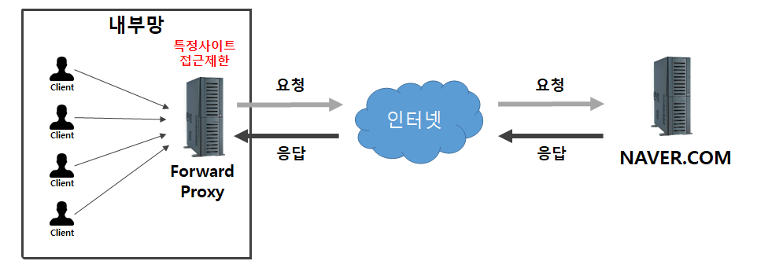
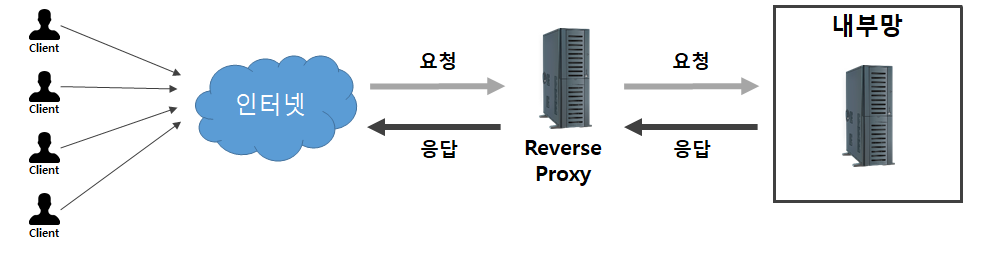

# 💬 목차

[REST API란 무엇인가요?](#rest-api란-무엇인가요)
 
[SSR과 CSR의 차이와 장단점](#ssr과-csr의-차이와-장단점)  
[Network OSI 7계층에 대해서 설명해주세요.](#network-osi-7계층에-대해서-설명해주세요)  
[Network TCP/IP 4계층에 대해서 설명해주세요.](#network-tcpip-4계층에-대해서-설명해주세요)  
[포워드 프록시와 리버스 프록시란 무엇이고, 어떤 차이가 있나요?](#포워드-프록시와-리버스-프록시란-무엇이고-어떤-차이가-있나요)  
[세션과 JWT의 특징과 차이](#세션과-jwt의-특징과-차이) 
[OAuth란 무엇이고 왜 사용하는가?](#oauth란-무엇이고-왜-사용하는가) 
[HTTP메소드 GET과 POST의 차이](#http메소드-get과-post의-차이)

# REST API란 무엇인가요?

- REST란 HTTP URI로 잘 표현된 자원에 대한 행위를 뜻합니다.
- 설계규칙으로는 “URI는 정보의 자원만 표현해야하며, 자원의 상태와 행위는 HTTP Method에 명시 하는것”을 뜻합니다.
- 위와 같은 REST 기반으로 API를 구한 것을 REST API라고 합니다.
- RESTful API는 HTTP 통신을 REST 설계규칙을 잘 지켜서 개발한 API를 뜻합니다.

-----

# SSR과 CSR의 차이와 장단점

모두 페이지를 렌더링하는 방식

### SSR( Server-Side Rendering )

- 서버에서 HTML 페이지를 준비하여 클라이언트 브라우저에게 보냄
- 브라우저는 이를 렌더링하여 페이지를 완성

### 장점

- 서버에서 HTML 페이지를 준비하기 때문에 초기 로딩 시간이 단축

### 단점

- 모든 요청에 대해 서버에서 HTML 페이지를 준비해야 하므로 서버 자원이 많이 사용
- 사용자 상호작용에 대한 대기 시간이 있음
    
    초기 로딩 속도가 빠르지만, 페이지의 자바스크립트 파일을 다운로드하고 실행해야 사용자 상호작용이 가능합니다.
    

### CSR( Client-Side Rendering )

- 페이지의 초기 로드 시에는 서버에서 받은 HTML 파일이 비어있는 상태이며, 브라우저에서 자바스크립트 파일을 로드하고 실행하여 페이지를 완성

### 장점

- 빠른 사용자 상호작용이 가능
    
    페이지를 처음 로드할 때는 HTML 파일이 비어있지만, 자바스크립트 파일을 다운로드하고 실행하여 페이지를 완성하기 때문에 사용자 상호작용이 빠릅니다.
    
- 서버 자원이 적게 필요
    
     서버에서는 단순히 자바스크립트 파일만 보내주면 되므로 서버 자원을 적게 사용
    

### 단점

- 초기 로딩 속도가 느림
    
    초기 로딩 시에는 서버에서 받은 HTML 파일이 비어있기 때문에, 자바스크립트 파일을 다운로드하고 실행해야 페이지를 완성할 수 있음
    
# [network]OSI 7계층에 대해서 설명해주세요.

**osi 7계층이란?**

국제표준화기구(International Organization for Standardization)에서 네트워크 통신 과정을 7단계로 나눈 것을 말합니다.

**Physical Layer 1계층**

데이터를 **인터넷 케이블이나 라우터** 등으로 전기적 신호를 아날로그 신호인 0과 1로 바꿔 내보내고 들어오게 하는 제일 첫번째 계층이자 모듈 / **PHY칩**이라는 하드웨어 부품에 구현되어있음.

**Data Link Layer 2계층**

같은 네트워크에 있는 **여러 대의 컴퓨터들이 데이터를 주고 받기 위해** 필요한 계층이자 모듈인데, **framing**이라는 작업이 이루어지며 이것은 데이터를 encoding해주는 역할을 하고 이는 여러대의 컴퓨터가 통신하는 상황에도 데이터를 구분해주는 역할을 위해 만든 것 / **랜카드**라는 하드웨어 부품에 구현되어있음

**Network Layer 3계층 → framing한 데이터를 받기 위해 만들어진 계층**

네트워크 간 데이터 전송을 위해 **패킷**하여 목적지를 찾아내고 자신 다음의 **라우터**에 데이터를 넘겨주는 계층이자 모듈 / 운영체제 커널에 소프트웨어적으로 구현되어있음

**패킷** → data에 ip 주소를 붙인 것

**라우터** → 컴퓨터 네트워크 간에 데이터 패킷을 전송하는 네트워크 장치

**Transport Layer 4계층 → 어떤 데이터를 무슨 프로세스에게 줘야할지 컴퓨터는 어떻게 알까? 포트번호**

**Port** 번호를 사용하여 도착지 컴퓨터의 최종 도착지인 프로세스 즉, **켜고 있는 인터넷 창까지 데이터가 도달하게 만드는** 계층이자 모듈 / 운영체제 커널에 소프트웨어적으로 구현되어있음

**port** → 운영 체제 통신의 종단점으로 네트워크 서비스나 특정 프로세스를 식별하는 논리 단위 / 포트를 주로 사용하는 프로토콜은 전송 계층 프로토콜이라 하며 TCP와 UDP가 있고 포트 번호는 IP 주소와 함께 쓰입니다.

**Session Layer 5계층**

TCP/IP 세션을 만들고 없애는 책임을 지고 있어 **통신을 관리**하는 역할의 계층이자 모듈로 통신 방식인 전이중(예 → 전화), 반이중(예 → 무전기), 단순(예 → TV) 등을 결정합니다. 포토 연결이라고도 하며, SSH, TLS 등이 대표적인 프로토콜입니다.

**Presentation Layer 6계층**

**데이터를 어떤 형태로 가질 것인지 정하는 역할**을 하는 계층이자 모듈로 데이터의 인코딩, 디코딩, 암호화, 복호화 등을 수행하고 GIF나 JPG같은 형식을 구분하기도 합니다.

**Application Layer 7계층 → data를 status code로 감싸는 영역**

HTTP 등의 프로토콜이 포함된 계층이자 모듈로 초기에는 WWW 상의 하이퍼텍스트 형태의 문서를 전달하는데 주로 이용하였고 현재는 이미지, 비디오, 음성 등 거의 모든 형식의 데이터를 전송할 수 있다.

# [Network]TCP/IP 4계층에 대해서 설명해주세요.

**패킷 통신이란?**

데이터를 패킷이라는 작은 단위로 나눠 전송하는 방식

**IP란?**

패킷 데이터를 최대한 빠르게 목적 주소로 보내는 프로토콜

패킷 전달 여부 보증 x / 패킷 보낸 순서와 받는 순서 다를 수 있음

**TCP란?**

패킷 통신 중 순서가 뒤섞이거나 내용이 유실되는 단점을 보완한 것이 TCP, 패킷을 정상적으로 받을 수 있도록 하는 프로토콜

**TCP 특징**

**장점**

- 패킷 전달 여부 보증
- 송신 순서대로 패킷을 받게 해줌
- 만약 패킷이 손상되거나 손실되었다면 출발지에서 재요청하는 방식으로 진행

**단점**

- IP보다 패킷 전송 속도 느림

**TCP/IP란?**

IP와 TCP의 묶음으로 두가지 프로토콜 방식을 조합한 인터넷 통신을 말하고 TCP/IP 방식의 네트워크에서 통신이 일어나는 과정을 4단계로 나눈 것이 TCP/IP 4계층입니다.

보완점 → TCP의 느린점, IP의 내용 손실 혹은 순서 바뀜 → 속도 향상, 패킷 정상 도착

- 프로토콜 스택(;프로토콜 스위트) → 복수의 프로토콜 집합 / 프로토콜 스택끼리는 통실 불가

**TCP/IP 4계층의 캡슐화, 역캡슐화**

캡슐화 → 데이터가 Application Layer에서 Network Access Layer 혹은 Physical Layer로 이동하면서 해당 계층에서 인코딩을 하는데, 이것을 캡슐화라고 한다.

역캡슐화 → 캡슐화의 반대 현상이다.

**Application Layer**

응용 프로그램에서 데이터를 처리하는 계층 / HTTP, HTTPS, POP3, SMTP, FTP 등

**Transport Layer**

어플리케이션에서 넘어온 데이터에 대한 검증, 재전송 등 각종 제어를 담당하는 계층 / TCP, UDP 등

**Internet Layer**

데이터를 목적지까지 효율적으로 전달을 담당하는 계층 / IP, ICMP 등

**Network Access Layer**

실질적으로 데이터를 전송하는 계층 / Ethernet, Wi-Fi 등

**흐름 요약**

- [www.google.com](http://www.google.xn--com-of0o/) 브라우저 주소창에 입력
- 보낼 패킷의 HTTP 헤더 → HTTP Request를 통해 채워진 상태
- 보낼 패킷의 IP 헤더를 채우기 위해, DNS 서버를 통해 [www.google.com](http://www.google.xn--com-of0o/) 도메인의 IP 주소를 응답 받습니다.
- 보낼 패킷의 TCP 헤더를 채우기 위해, 클라이언트와 구글 웹서버 간 TCP 연결을 합니다.
    - 3-Way Handshaking
- 보낼 패킷이 완성되었으므로, [www.google.com](http://www.google.com/) 에 패킷을 전송하고, HTML 을 응답받습니다.
- 클라이언트는 응답 받은 HTML 을 브라우저에 띄웁니다.
- 클라이언트와 구글 웹서버간 TCP 연결을 종료합니다.
    - 4-Way Handshaking

# 포워드 프록시와 리버스 프록시란 무엇이고, 어떤 차이가 있나요?

### 프록시(Proxy)란?
프록시 서버는 클라이언트가 자신을 통해서 다른 네트워크 서비스에 간접적으로 접근할 수 있게 해 주는 컴퓨터 시스템이나 응용 프로그램을 가리킵니다.

한마디로, 서버와 서버 사이의 중계자 역할을 한다고 볼 수 있습니다.

프록시를 쓰는 이유는 보안상의 이유로 직접 통신할 수 없는 두 점사이에서 대리로 통신을 수행하여 보안성, 성능, 안정성을 향상시키기 위함입니다.

> 프록시 서버는 네트워크 상 어디에 위치하느냐, 혹은 어느 방향으로 데이터를 제공하느냐에 따라
> Forward Proxy 그리고 Reverse Proxy로 나뉩니다.

### 포워드 프록시(Forward Proxy)
포워드 프록시란, 프록시 서버가 클라이언트 바로 뒤에 있는 네트워크 구조를 의미합니다.

같은 내부망에 존재하는 클라이언트의 요청을 받아 인터넷을 통해 외부 서버에서 데이터를 가져와 클라이언트에게 응답해줍니다.  
즉, 클라이언트가 서버에 접근하고자 할 때, 클라이언트는 타겟 서버의 주소를 포워드 프록시에 전달하여, 포워드 프록시가 인터넷으로 요청된 내용을 가져오는 방식입니다.

#### 장점
- **클라이언트 보안** : 포워드 프록시 서버는 방화벽과 비슷한 개념으로 볼 수 있다. 예를 들어 포워드 프록시 서버에 룰을 추가해 특정 사이트에 접속하는 것을 막을 수 있다.
- **캐싱** : 포워드 프록시에 캐싱되어 있는 데이터를 사용하기 때문에 더 빠른 성능을 경험할 수 있다.
- **암호화** : 클라이언트의 요청은 포워드 프록시 서버를 통과할 때 암호화된다. 암호화된 요청은 다른 서버를 통과할 때 필요한 최소한의 정보만 갖게 되고, 이는 클라이언트 IP를 감춰주는 보안 효과를 가진다.

### 리버스 프록스(Reverse Proxy)
리버스 프록시란, 프록시 서버가 서버 바로 앞에 있는 네트워크 구조를 의미합니다.

클라이언트는 웹서비스에 접근할 때, 웹서버에 요청하는 것이 아닌 프록시로 요청하게 되고 프록시가 배후의 서버로부터 데이터를 가져오는 방식입니다.

- 우리가 구성하는 일반적은 WEB - WAS 분리 형태를 리버스 프록시라고 볼 수 있습니다.
- 여기서 WEB이 리버스 프록시가 된다.
- 물론 아파치 톰캣과 같이 물리적인 한서버에 WEB, WAS가 존재한다면 리버스 프록시라고 볼 수 없습니다.

#### 장점
- **로드 밸런싱** : 서버 과부화를 막기 위한 작업
- **서버 보안** : 본래 서버가 아닌 리버스 프록시로 요청을 하기 때문에, 본래 서버의 IP 주소를 노출시키지 않을 수 있다.
- **캐싱** :  한국에서 타국에 있는 웹서버를 사용할 때, 리버스 프록시 서버가 한국에 있다고 가정해보자. 한국에 있는 유저는 한국에 있는 리버스 프록시 서버와 통신해 리버스 프록시 서버에 캐싱되어 있는 데이터를 사용할 경우에 더 빠른 성능을 경험할 수 있다.
- **암호화** : SSL 암호화에 좋다.

> 클라이언트쪽으로 데이터(Response)를 밀어주는게 포워드라면, 
> 그 반대편인 서버 쪽으로 데이터(Request)를 밀어주는 것이 리버스라고 볼 수 있습니다.

### 포워드 프록시와 리버스 프록시의 차이점
- 프록시 서버의 위치에 차이가 있다.  
포워드 프록시 서버는 클라이언트 앞에 놓여져 있고, 리버스 프록시 서버는 서버 앞에 놓여져 있다.
- 프록시 서버의 통신 대상이 다르다.  
포워드 프록시는 내부망에서 클라이언트와 프록시 서버가 통신하며, 리버스 프록시는 프록시 서버와 내부망서버가 통신을 한다.
- 감춰지는 대상  
포워드 프록시는 직접 서버 URL로 요청하지만, 리버스 프록시는 프록시 서버 URL로 요청을 한다. 때문에 리버스 프록시는 본서버의 IP 정보를 숨길 수 있다.  
포워드 프록시는 내부망의 요청을 프록시 서버가 서버로 요청하기 때문에 서버에게 클라이언트가 누구인지 감출 수 있습니다.

[[WEB] 🌐 Reverse Proxy / Forward Proxy 정의 & 차이 정리](https://inpa.tistory.com/entry/NETWORK-%F0%9F%93%A1-Reverse-Proxy-Forward-Proxy-%EC%A0%95%EC%9D%98-%EC%B0%A8%EC%9D%B4-%EC%A0%95%EB%A6%AC#%EB%A6%AC%EB%B2%84%EC%8A%A4_%ED%94%84%EB%A1%9D%EC%8B%9C_reverse_proxy)

# 세션과 JWT의 특징과 차이
HTTP의 비상태성이라는 특성 때문에 사용자를 인가하는데 어려움이 있는데 이 문제를 해결해 주는 것이 세션과 토큰이라고 할 수 있다.

**세션 방식** : 정보를 서버측에 저장하는 방식이다. 사용자가 로그인을 하면 해당 인증 정보는 서버의 세션 저장소에 저장하고 서버는 SessionID를 발급한다. 추후 브라우저는 요청 때마다 Http Cookie 헤더에 Session Id를 함께 서버로 전송하고 서버는 Session Id가 서버 세션 저장소에 존재한다면 유효한 사용자로 판단한다. 

**토큰 방식** : 토큰 방식은 세션 방식과 다르게 인증 정보를 클라이언트가 갖고 있다. 대표적인 토큰인 JWT의 경우 디지털 서명이 존재해 토큰의 내용이 위변조 되었는지 서버측에서 확인한다. 서버에서는 토큰을 받고 위, 변조 되었는지 확인하고 토큰에 담겨 있는 사용자 인증 정보를 확인해 사용자를 인가한다. 

 
 ### 세션방식과 토큰 방식의 비교 
**트래픽**  
세션의 경우 헤더에 Session Id만 실어보내면 되므로 트래픽을 적게 사용하지만 JWT의 경우 사용자 인증정보와 발급시각, 만료시간, 토큰 id 등 세션에 비해 정보가 많이 담겨 있어 세션 방식보다 많은 네트워크 트래픽을 사용한다.  

**보안**  
세션의 경우 모든 인증 정보를 서버에 저장하므로 보안 측면에서 조금 더 유리하다고 할 수 있다. 만약 세션이 탈취 당하더라도 서버에서 해당 세션을 무효 처리할 수 있다.  
하지만 토큰의 경우 클라이언트에서 인증정보를 갖고 있으며 토큰이 탈취당하면 만료되기 전까진 서버에서 알지 못한다. 또한 Payload가 별도로 암호화 되어 있지 않아 누구나 내용을 확인할 수 있다.  

**확장성**  
일반적으로 웹 어플리케이션의 경우 수평확장을 하는데 한대가 아닌 여러 대의 서버가 요청을 처리한다. 이 때 세션의 경우 세션 불일치 문제가 일어난다. 이를 해결하기 위해서 Sticky Session, Session Clustering, 세션 스토리지 외부 분리 등의 작업이 필요하다.  
토큰 방식의 경우 서버가 직접 인증 방식을 저장하지 않기 때문에 세션 불일치 문제로부터 자유롭다. 이런 방식에서 서버의 수평 확장에 큰 이점을 가져갈 수 있다.  

**서버의 부담**  
세션의 경우 서버에서 세션 데이터를 직접 저장하고 관리한다. 따라서 세션 데이터의 양이 많아지면 서버의 부담이 증가할 수 있다.  
하지만 토큰 방식에서는 클라이언트에서 토큰을 갖고 있으므로 유저의 수가 늘어나도 서버의 부담이 증가하지 않는다. 

# OAuth란 무엇이고 왜 사용하는가?
> OAuth는 인터넷 사용자들이 비밀번호를 제공하지 않고 다른 웹사이트 상의 자신들의 정보에 대해 웹사이트나 애플리케이션의 접근 권한을 부여할 수 있는 공통적인 수단으로서 사용되는, 접근 위임을 위한 개방형 표준이다. - 위키백과

일반적으로 웹사이트에 나의 정보를 준다는 것은 부담스러운 일이다.

해당 사이트를 믿을 수 있는지 신뢰성의 문제가 있고 실제로 개인정보 유출 사건이 종종 일어나기도 한다. 따라서 개인정보를 입력한다는 것은 사용자들에게도 사이트 운영자 측도 부담이 될 수밖에 없다. 그래서 이 부분을 해결해 주는 것이 OAuth라고 할 수 있다.

개인 정보는 큰 기업에 저장하고, 해당 기업에서 인가 정보를 받으면서 운영자 쪽은 보안에 대한 부담을 덜 수 있고 사용자 측은 안전함과 편리함을 얻을 수 있다.

# HTTP GET과 POST의 차이는 무엇인가요?

1. HTTP GET이란 무엇인가요?

    클라이언트가 서버의 정보를 요청하기 위해 사용하는 메서드입니다

2. 그렇다면 HTTP GET의 요청 방식은 어떻게 되나요?

    쿼리 스트링의 형태로 url 주소 끝에 요청하고 싶은 데이터 정보를 입력합니다.

3. 쿼리 스트링이란 무엇인가요?

    사용자가 입력 데이터를 전달하는 방법 중 하나로 
    url 주소에 미리 협의된 데이터를 파라미터를 통해 넘기는 것입니다.

4. 그럼 HTTP GET의 장점은 무엇인가요?

    캐시가 가능한데, 웹 캐시가 서버로 가기 전에 요청을 받아 리소스 복사본을 반환합니다.
    그리고 히스토리에 정보가 남으며 북마크도 가능합니다.

5. 그럼 HTTP GET의 단점은 무엇인가요?

    일단 브라우저마다 다르지만 길이 제한이 있고 쿼리 스트링의 특징이기도 한데, 
    중요한 정보를 파라미터에 넣으면 안됩니다. 그래서 요청할 때만 사용합니다.

6. HTTP GET이란 무엇인가요?

    클라이언트가 서버의 정보를 요청하기 위해 사용하는 메서드입니다

7. 그렇다면 HTTP GET의 요청 방식은 어떻게 되나요?

    쿼리 스트링의 형태로 url 주소 끝에 요청하고 싶은 데이터 정보를 입력합니다.

8. 쿼리 스트링이란 무엇인가요?

    사용자가 입력 데이터를 전달하는 방법 중 하나로 
    url 주소에 미리 협의된 데이터를 파라미터를 통해 넘기는 것입니다.

9. 그럼 HTTP GET의 장점은 무엇인가요?

    캐시가 가능한데, 웹 캐시가 서버로 가기 전에 요청을 받아 리소스 복사본을 반환합니다.
    그리고 히스토리에 정보가 남으며 북마크도 가능합니다.

10. 그럼 HTTP GET의 단점은 무엇인가요?

    일단 브라우저마다 다르지만 길이 제한이 있고 쿼리 스트링의 특징이기도 한데, 
    중요한 정보를 파라미터에 넣으면 안됩니다. 그래서 요청할 때만 사용합니다.

위에 post와 get을 사용해보셨다면 아마 put과 delete도 사용해보셨을 거라고 생각합니다.
그럼 put과 patch에 대해 질문 드리겠습니다.

11. HTTP PUT이란 무엇인가요?

    요청 페이로드를 사용하여 새로운 리소스를 생성하거나 대상 리소스를 나타내는 데이터를 
    대체하는 메소드입니다.

12. 그럼 HTTP PATCH란 무엇인가요?

    리소스의 부분적인 수정을 할 때 사용하는 메소드입니다.

13. 둘 다 수정하는 부분에서는 큰 차이를 못 느끼겠는데, 혹시 어떤 차이점이 있고 어떻게 쓰는지
알 수 있을까요?

    둘의 단점을 이해하면 쉬울 것 같습니다. put은 자원의 일부 상태만 새로운 값으로 보냈을 때
    새로운 값을 받은 컬럼은 새로운 값을 반환하지만 새로운 값을 받지 못한 컬럼은 의도하지 않았어도
    null값으로 처리됩니다. 그리고 patch는 기존에 데이터가 없으면 새로운 요청을 보내도 서버에서 
    오류를 응답합니다.
    
# HTTP메소드 GET과 POST의 차이

HTTP( HyperText Transfer Protocol) 에서 사용하는 메소드 중 하나

## GET

서버로부터 **데이터를 요청**하고 받아오기 위해 사용하는 메소드

### 특징

- 요청하는 URL 뒤에 데이터를 붙여서 전송
- 캐싱을 지원하기 때문에 같은 요청을 반복할 경우 더 빠른 응답

## POST

서버에 **데이터를 제출**하기 위해 사용

### 특징

- 데이터를 HTTP요청 메시지 `Body`에 포함시켜 전송
- 폼 데이터나 JSON 등 다양한 형태로 전송 가능
- GET메소드와 달리 데이터의 크기에 제한이 없고, 보안적인 이유로 캐싱을 지원하지 않음

## 차이가 뭔데?

### 사용목적

> `GET`은 서버에서 **데이터를 요청** 
`POST`는 서버에 **데이터를 제출**

### 보안

> `GET`은 **URL 뒤에 데이터를 붙여서** 전송하기 때문에 보안에 취약 
`POST`는 **데이터를 Body에 포함**시켜 전송하기 때문에 보안성이 높음

### 데이터 크기

> `GET`은 URL길이에 제한이 있어서 보낼 수 있는 **데이터 크기에 한계**가 있음 
`POST`는 Body에 데이터를 포함시켜 전송하기 때문에 **큰 데이터를 보낼 수 있음**

### 캐싱

> `GET`은 **요청 결과를 캐싱**하기 때문에 같은 요청이 반복되면 더 빠른 결과를 받을 수 있음 
`POST`는 요청 결과를 **캐싱하지 않음**
